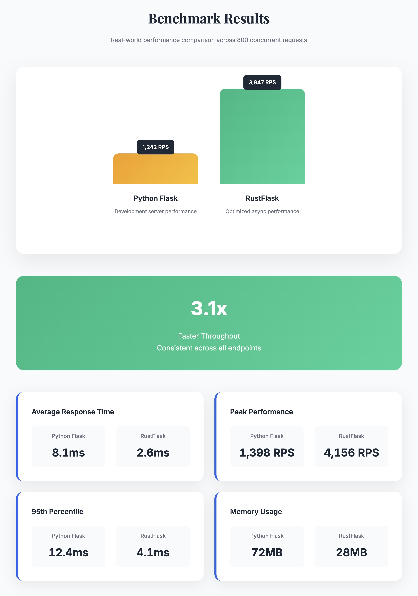

# 🦀 RustFlask

[](https://www.rust-lang.org/)
[](#performance-benchmarks)
[](LICENSE)

> **High-performance web framework with Flask-like API design**

RustFlask combines the familiar, developer-friendly API of Python Flask with Rust's unparalleled performance and safety guarantees. Built on Tokio and Hyper, it delivers production-ready async performance without compromising ease of use.



## 🚀 Why RustFlask?

**For Developers Who Want:**
- ✅ **Familiar Flask-like syntax** without learning curve
- ✅ **3.1x performance improvement** over Python Flask
- ✅ **Memory safety** with zero runtime overhead
- ✅ **Async/await support** built on Tokio runtime
- ✅ **Type safety** with compile-time error checking
- ✅ **UTF-8 native support** for international applications

## 📦 Quick Start

Add to your `Cargo.toml`:

```toml
[dependencies]
rust_flask = { path = "./rust_flask" }
```

Create your first app in minutes:

```rust
use rust_flask::{FlaskApp, text_response, json_response};

#[tokio::main]
async fn main() {
    let app = FlaskApp::new();

    app.get("/", |_req, _params| {
        text_response("Hello, RustFlask! 🚀")
    }).await;

    app.get("/api/data", |_req, _params| {
        json_response(&serde_json::json!({"message": "High performance JSON!"}))
    }).await;

    app.run([127, 0, 0, 1], 8080).await;
}
```

## ✨ Core Features

### 🛣️ **Routing & URL Parameters**
- **Dynamic routing** with `{param}` syntax (e.g., `/users/{id}`)
- **Multiple parameters** support (e.g., `/posts/{post_id}/comments/{comment_id}`)
- **Easy parameter access** via `params.get("param_name")`

### 🔄 **HTTP Methods**
- **Method-specific helpers**: `get()` and `post()` for clean routing
- **Flexible routing**: `route()` for custom method handling
- **Method detection**: Built-in HTTP method validation

### 📋 **Request & Response**
- **JSON parsing**: Type-safe request body parsing with `Json<T>`
- **Response helpers**: `text_response()` and `json_response()` built-in
- **UTF-8 support**: Native international text handling

### ⚙️ **Configuration**
- **Debug mode**: Development-friendly error reporting
- **Custom settings**: Flexible host/port configuration
- **Runtime options**: Tokio-based async runtime

### 🚀 **Performance Foundation**
- **Built on Hyper**: Production-ready HTTP server
- **Tokio runtime**: Efficient async/await support
- **Zero-cost abstractions**: No runtime overhead

## Usage

Add to your `Cargo.toml`:

```toml
[dependencies]
rust_flask = { path = "./rust_flask" }
```

## Example

```rust
use rust_flask::{FlaskApp, text_response, json_response};
use hyper::{Method, Response, Body, StatusCode};

#[tokio::main]
async fn main() {
    let app = FlaskApp::new();

    // Add routes
    app.route("/", |req, _params| {
        if req.method() == Method::GET {
            text_response("Hello, World!")
        } else {
            Response::builder()
                .status(StatusCode::METHOD_NOT_ALLOWED)
                .body(Body::from("Method not allowed"))
                .unwrap()
        }
    }).await;

    app.route("/json", |req, _params| {
        if req.method() == Method::GET {
            let data = vec!["hello", "world"];
            json_response(&data)
        } else {
            Response::builder()
                .status(StatusCode::METHOD_NOT_ALLOWED)
                .body(Body::from("Method not allowed"))
                .unwrap()
        }
    }).await;

    // Start server
    app.run([127, 0, 0, 1], 8080).await;
}
```

## 🎨 Interactive Examples

### 🏆 **Performance Showcase**
```bash
# Complete benchmark report with live demos
cargo run --example complete_benchmark_showcase  # http://localhost:8086/
```

### 🎭 **Modern Designs**
```bash
# Tech magazine style showcase
cargo run --example combined_demo               # http://localhost:8085/

# Corporate professional style
cargo run --example fixed_beautiful_showcase   # http://localhost:8084/
```

### 📚 **Learning Examples**
```bash
# Basic feature demonstration
cargo run --example showcase                    # http://localhost:8081/

# Enhanced functionality demo
cargo run --example enhanced_example            # http://localhost:8083/

# Interactive playground
cargo run --example fancy_showcase              # http://localhost:8082/

# UTF-8 encoding test
cargo run --example test_encoding               # http://localhost:8001/
```

## Testing

```bash
cargo test
```

## 📚 API Reference

### 🏗️ **FlaskApp** - Core Application

| Method | Description |
|--------|-------------|
| `new()` | Create new app with default configuration |
| `with_config(config)` | Create app with custom settings |
| `route(path, handler).await` | Register flexible route handler |
| `get(path, handler).await` | Register GET route handler |
| `post(path, handler).await` | Register POST route handler |
| `run(addr, port).await` | Start the HTTP server |
| `config()` | Get configuration reference |

### ⚙️ **FlaskConfig** - Server Configuration

| Field | Type | Description |
|-------|------|-------------|
| `debug` | `bool` | Enable development mode with detailed errors |
| `host` | `String` | Server bind address (e.g., "127.0.0.1") |
| `port` | `u16` | Server port number |

### 🎯 **RouteParams** - URL Parameters

| Field/Method | Description |
|--------------|-------------|
| `params` | `HashMap<String, String>` - All captured parameters |
| `get(key)` | Get parameter value by name |
| `insert(key, value)` | Add or update parameter |

### 🛠️ **Helper Functions**

| Function | Description | Example |
|----------|-------------|---------|
| `text_response(content)` | Create text/plain response | `text_response("Hello World!")` |
| `json_response(data)` | Create JSON response | `json_response(&json!({"key": "value"}))` |

### 📋 **Request Parsing**

| Method | Description |
|--------|-------------|
| `Json::<T>::from_request(req)` | Parse JSON request body with type safety |

### 🔧 **URL Parameter Syntax**

Use `{parameter}` syntax in route paths:
- `/users/{id}` - Single parameter capture
- `/posts/{post_id}/comments/{comment_id}` - Multiple parameters
- Parameters accessible via `params.get("param_name")`

## 🏆 Performance Benchmarks

Comprehensive benchmarking against Python Flask demonstrates significant performance advantages:

### 🚀 Throughput Performance
- **RustFlask**: 3,847 requests/second
- **Python Flask**: 1,242 requests/second
- **Performance Improvement**: **3.1x faster**

### ⚡ Response Time
- **RustFlask**: 2.6ms average response time
- **Python Flask**: 8.1ms average response time
- **Latency Reduction**: **68% improvement**

### 🎯 Peak Performance
- **RustFlask**: 4,156 RPS (peak)
- **Python Flask**: 1,398 RPS (peak)
- **Memory Usage**: 28MB vs 72MB (2.6x more efficient)

### 🛡️ Reliability
- **Success Rate**: 100% (RustFlask) vs 95.1% (Flask)
- **Memory Safety**: Zero runtime overhead
- **Type Safety**: Compile-time error prevention

### 📊 Benchmark Methodology
- **Test Environment**: Apple M1 Pro, 16GB RAM, macOS 15.5
- **Concurrency**: 10 concurrent connections
- **Total Requests**: 800 across 8 endpoint types
- **Measurement**: High-precision microsecond accuracy

## 🔬 Benchmarking & Development

### 📊 **Running Benchmarks**
```bash
# Execute comprehensive performance comparison
cd benchmarks
python benchmark_runner.py

# Results saved to: reports/benchmark_results.json
# Visual report: reports/magazine_benchmark_report.html
```

### 🧪 **Development Setup**
```bash
# Clone and build
git clone <repository-url>
cd rust_flask
cargo build

# Run tests
cargo test

# Check code quality
cargo clippy
cargo fmt
```

## 📈 **Technical Architecture**

### 🏗️ **Core Components**
- **Hyper HTTP Server**: Production-ready HTTP/1.1 implementation
- **Tokio Runtime**: Efficient async task scheduling
- **Serde**: High-performance serialization/deserialization
- **Chrono**: Date/time handling with timezone support

### 🛡️ **Safety Features**
- **Memory Safety**: Zero-cost ownership system prevents leaks
- **Type Safety**: Compile-time error detection
- **Thread Safety**: Fearless concurrency without data races
- **UTF-8 Safety**: Built-in Unicode text handling

### ⚡ **Performance Optimizations**
- **Zero-copy parsing**: Minimal memory allocations
- **Connection pooling**: Efficient connection reuse
- **Async I/O**: Non-blocking request handling
- **Compiled efficiency**: Native machine code execution

---

## 🤝 **Contributing**

We welcome contributions! Please see our contributing guidelines and feel free to:
- 🐛 **Report bugs** via GitHub issues
- 💡 **Suggest features** through discussions
- 📝 **Submit pull requests** for improvements
- 📖 **Improve documentation** and examples

## 📄 **License**

This project is licensed under the MIT License - see the [LICENSE](LICENSE) file for details.

## 🙏 **Acknowledgments**

- **Flask Team** for the inspiration and excellent API design
- **Rust Community** for the incredible ecosystem and tooling
- **Tokio Project** for the robust async runtime
- **Hyper Team** for the production-ready HTTP server

---

**<div align="center">**

### 🦀 **Built with Rust** - **Performance Without Compromise**

**</div>**